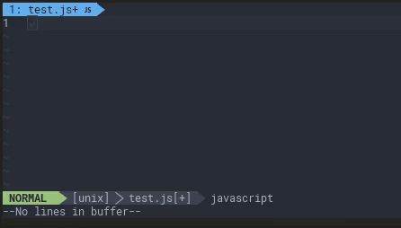

# oid-cli

[](https://packagephobia.now.sh/result?p=oid-cli@1.0.3)

A tiny little tool only 33K install size, that allow you generate mongo ObjectId direct in you terminal.

## Installation
```console
yarn global add oid-cli
```

## usage
```console
oid
# outputs
5ac177bf70d53847e8785eac
```

with arguments
```console
oid -n5
# outputs
5ac177f250dbba4954955bb9
5ac177f250dbba4954955bba
5ac177f250dbba4954955bbb
5ac177f250dbba4954955bbc
5ac177f250dbba4954955bbd

```

## Usage with VIM + UltiSnips
with single quotes
```text
snippet /[']oid/ "MongoDB ObjectId" r
'`oid`'
endsnippet
```
whitout quotes
```text
snippet /[.]oid/ "MongoDB ObjectId" r
`oid`
endsnippet
```


